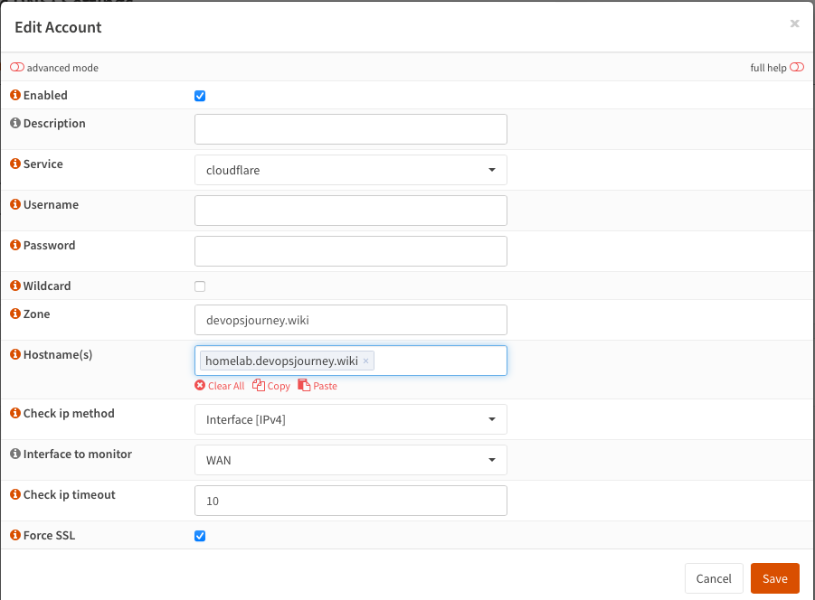
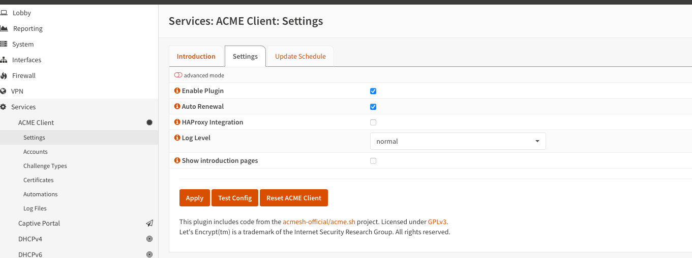
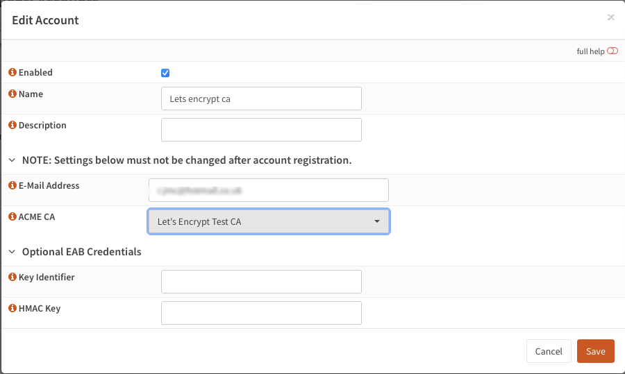
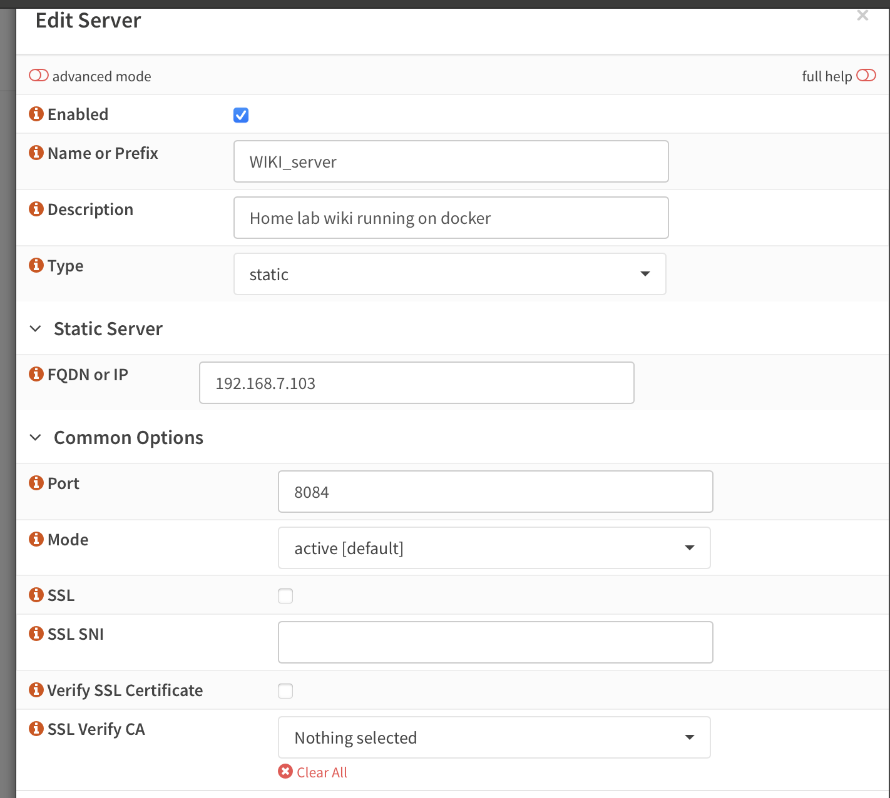
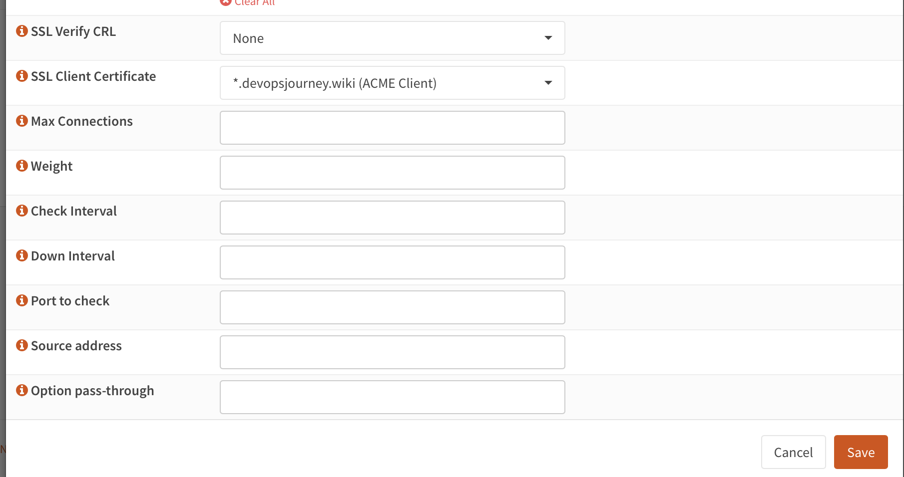
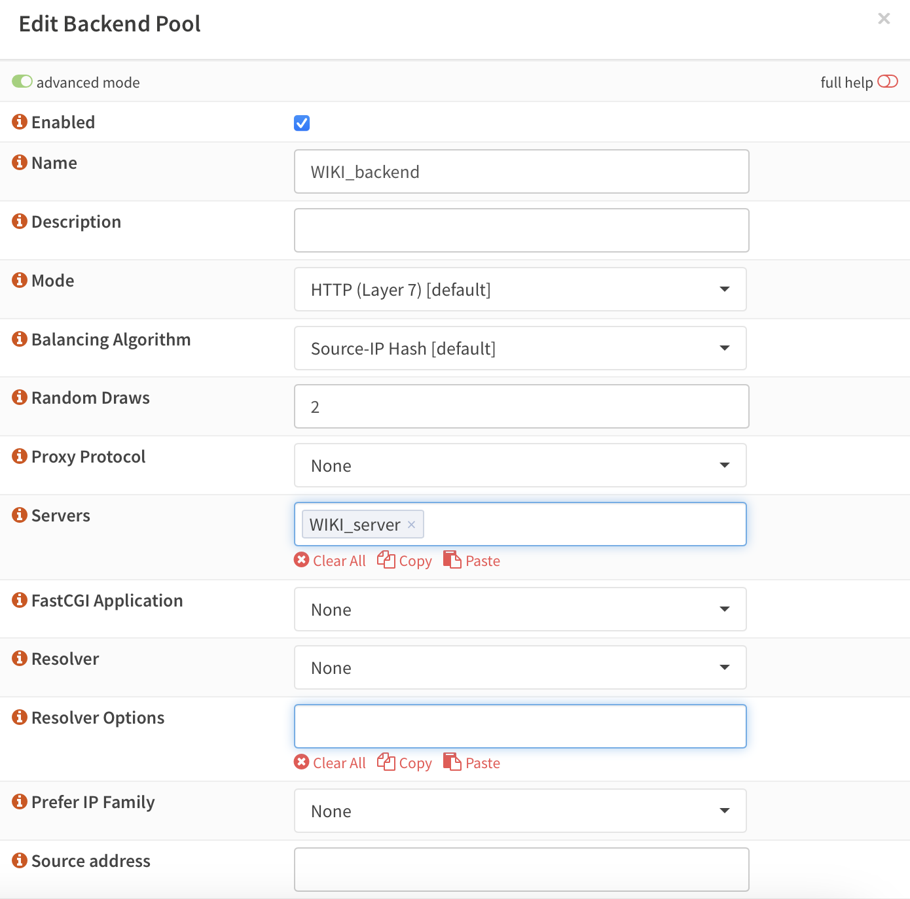
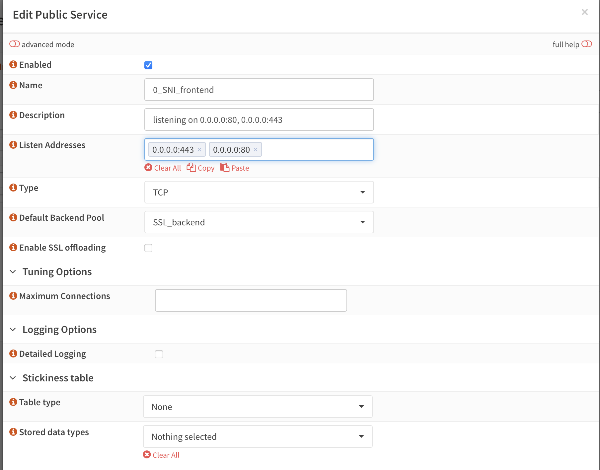
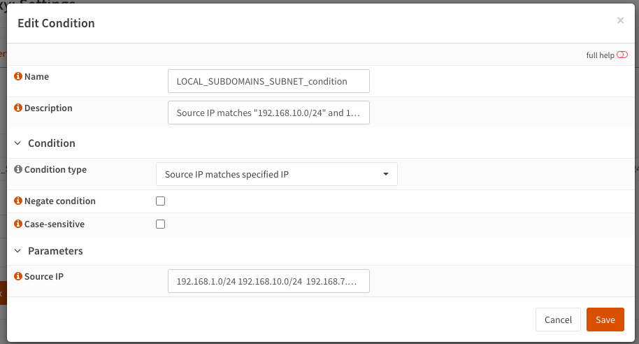

# HAProxy + Traefik + Let's Encrypt Wildcard Certificates + 100% A+ ssl Rating

## Configuration Guide

This is the help anyone wanting to implement a reverse proxy into their homelab environment, for hosting personal websites and projects to the public.

### Part 1 - Plugin Installation

1\. **Update your OPNsense to the latest version and ensure you're using the OpenSSL firmware flavor, as LibreSSL doesn't support TLS 1.3.**
- Navigate to "System --> Firmware --> Updates" and install all updates.

2\. **Install necessary plugins:**
- Go to "System --> Firmware --> Plugins" and install the following: `os-acme-client`, `os-ddclient`, `os-haproxy`.

### Part 2 - Dynamic DNS Configuration using cloudflare

1\. **Create and verify an account on [cloudflare](https://dash.cloudflare.com/sign-up).**

2\. **Create your subdomain:**
- Go to [cloudflare > websites > domain name > DNS > records](https://dash.cloudflare.com/) and create your domain (e.g. `homelab.devopsjourneys.wiki`).
   
   

3\. **Generate and save a token:**
   - Log in to your Cloudflare account and navigate to the dashboard.
   - Click on the profile icon in the top right corner and select "My Profile."
   - In the left-hand menu, click on "API Tokens," then select "Create Token."
   - Choose the "Edit zone DNS" template from the list of API token templates.
   - In the "Zone Resources" section, select the desired domain from the right-most dropdown menu, then click "Continue to summary."
   - Verify that the API token has DNS
   - permission for the selected domain and click "Create Token."

4\. Setup the Dynamic DNS plugin in OPNSENSE and enter the following information:

  - Enabled: true
  - Description: Cloudflare (Or whatever you want)
  - Service: Cloudflare
  - Username: token (the word, not your API token)
  - Password: <The cloudflare API key you generated earlier>
  - Zone: your.domain (e.g. devopsjourneys.wiki)
  - Hostname: full domain name (e.g. homelab.devopsjourneys.wiki)
  - Check ip method: Interface
  - Interface to monitor: WAN
  - Force SSL: true
  
  

### Part 3 - Let's Encrypt (ACME Client)

1\. **Configure ACME Client settings in OPNsense:**

   - Navigate to "Services --> ACME Client --> Settings" and adjust settings as this image.

2\. **Set update schedule for certificate renewal:**
  
In this section, we will set the time of day for certificate renewals. Certificates won't be renewed daily; the ACME client first checks if they are nearing expiration and only renews them if necessary. Schedule the renewal for a time when your services experience low traffic, as the ACME plugin will restart HAProxy to apply the new certificates, causing a brief downtime. Avoid scheduling renewals at exact hours (e.g., 3:00 AM) since Let's Encrypt servers might be overloaded, potentially causing the renewal process to fail
  - Go to "Services --> ACME Client --> Settings --> Update Schedule" and configure a time with low service load.
3\. **Create an ACME account:**
  - Go to "Services --> ACME Client --> Accounts" and create an account using the staging environment first.


4\. **Set up automation:**
  - Create an automation to restart HAProxy after certificate renewal.

5\. **Add DNS challenge:**
  - Go to "Services --> ACME Client --> Challenge Types" and add the DNS challenge for deSEC.

6\. **Add your certificate:**
  - Configure the certificate in "Services --> ACME Client --> Certificates".
 
I prefer using Elliptic Curve Cryptography (ECC) (https://en.wikipedia.org/wiki/Elliptic-curve_cryptography). However, you can also use RSA keys. If you choose RSA, ensure the key length is as long as possible to achieve an A+ rating from SSLLabs.
  - Forcefully issue a staging certificate for testing, then switch to the production environment and issue the certificate by selecting the highlighted part here:


 ### Part 4 - System Preparation

1\. **Adjust system settings:**
  - Go to "System --> Settings --> Administration" and change the Web GUI TCP port (anything other than 443), and disable the web GUI redirect rule.

2\. **Optional: Configure Virtual IPs:**
Create a virtual IP in a subnet different from any of your other networks. Ideally, select an IP from the localhost subnet to avoid conflicts in your local network (https://en.wikipedia.org/wiki/Localhost). In this tutorial, we will use "127.4.4.3/32" as the IP address for both the "HTTP_frontend" and "HTTPS_frontend".
  - Create a virtual IP in "Interfaces --> Virtual IPs --> Settings" if not using localhost.

3\. **Create a firewall alias:**
  - Go to "Firewall --> Aliases" and create an alias for HAProxy ports (port 80 and 443).

4\. **Set up firewall rules:**
  - Allow inbound traffic on HAProxy ports via "Firewall --> Rules --> WAN".


### Part 5 - HAProxy Configuration

1\. **Configure HAProxy settings:**
  - Go to "Services --> HAProxy --> Settings --> Service" and adjust as needed.

   - Update "Global Parameters" and "Default Parameters" in HAProxy settings.


2\. **Add real servers and backend pools:**
  - Here we add the "Real Servers" the internal IP in my case of my traefik instance running on docker, the description and port
  - The wildcard certificate we created above is also added here *.devopsjourney.wiki
  
  
  
  - Set up backend pools for services in "Virtual Services --> Backend Pools".
  



3\. **Create rules and conditions:**
  - Add a NoSSL_condition", which is necessary in order to identify non-HTTPS traffic
  
  - Create a HTTPtoHTTPS rule. This is so the client connection gets upgraded from HTTP to HTTPS and connects to the HTTPS_frontend
  - Create map files for public subdomains.
 Here, we will generate a new map file named "PUBLIC_SUBDOMAINS_mapfile" for the public subdomains we want to access externally from our network. HAProxy map files are used to store key-value pairs that can be referenced by HAProxy during its operation. These map files allow for efficient lookups and are typically used for tasks such as URL rewriting, header modification, or directing traffic based on specific criteria.
Key features of HAProxy map files include:
- Format: Each line in a map file represents a key-value pair, separated by spaces or tabs. The key is usually some form of input (like a URL or host) and the value is the corresponding output (like a backend server or a rewritten URL).

  Example:
  subdomain1.example.com backend1
  subdomain2.example.com backend2

- Usage: Map files are referenced in HAProxy configuration using directives such as use-server, acl, or http-request. This enables dynamic behavior based on the contents of the map file.
 - Efficiency: Map files allow HAProxy to handle complex routing and transformation rules efficiently without hardcoding them into the configuration, enabling easier updates and maintenance.
- Reloading: HAProxy can reload map files on the fly without requiring a full restart, which minimizes downtime and allows for dynamic updates to routing logic.
  
- Now create the Map file and PUBLIC_SUBDOMAINS_map-rule as follows
  
  

4\. **Configure Public Services (frontends):**
  - Set up SNI, HTTP, and HTTPS frontends in "Virtual Services --> Public Services".
  Here, we will set up the frontends to listen on our interface IPs and the virtual IP we created earlier. First, we will create the "SNI_frontend," which will determine whether the traffic should be SSL offloaded. You will need to place the rules for all services that you don't want to be SSL offloaded here. The default backend for this frontend will be the "SSL_backend," which redirects all traffic to our virtual "SSL_server," corresponding to our "HTTPS_frontend."
  
  - Now we will set up our "HTTP_frontend." Ensure that the "HTTPtoHTTPS_rule" is included in this frontend! This frontend is essential for redirecting HTTP traffic to HTTPS, but it can also be used to serve non-SSL encrypted services on port 80.
  
  
  
  - Now we will set up our "HTTPS_frontend." This will be our primary frontend, performing SSL offloading using the Let's Encrypt certificate we created earlier. You should include the "PUBLIC_SUBDOMAINS_rule" and all other rules for services that need SSL offloading here. The "Cipher List" and "Cipher Suites" will ensure we achieve a 100% A+ rating at SSLLabs.

  
### Part 6 - Internal Network Access

1\. **Option A: Split DNS:**
   If you attempt to access your URL "your_service.your_subdomain.dedyn.io" from a device within your internal network, it should fail There are two ways to resolve this issue. I will cover both options, but note that Split DNS (Option A) is the recommended approach. NAT Reflection (Option B) is a less favorable solution because it causes you to lose the ability to track the originating source IP in HAProxy when using NAT.

Option A - Split DNS (https://docs.opnsense.org/manual/unbound.html#overrides)
Option B - NAT Reflection (https://docs.opnsense.org/manual/nat.html)
  - Use Unbound DNS plugin for DNS overrides.
  - Go to "Services --> Unbound DNS --> Overrides" and create host overrides for each of your services. This applies if you are using second-level subdomains like "your_service.your_subdomain.dedyn.io" for your services. If all your services run on your first-level subdomain "your_subdomain.dedyn.io," you only need to override this one. The IP address can be any LAN (or VLAN) interface IP of your OPNsense. I am using the LAN IP that the "SNI_frontend" is also listening on, since we set it to "0.0.0.0".

2\. **Option B: NAT Reflection:**
  
 - Edit port forwarding rules in "Firewall --> NAT --> Port Forward" to enable NAT reflection.

### Part 7 - Local-Access-Only Subdomains

1\. **Create a local map file:**
 - In OPNsense, navigate to: Services --> HAProxy --> Settings --> Advanced --> Map Files. Here, clone the "PUBLIC_SUBDOMAINS_mapfile," rename it to something like "LOCAL_SUBDOMAINS_mapfile," and add all your local-access-only subdomains along with their corresponding backends. Remember that the contents of your "PUBLIC_SUBDOMAINS_mapfile" must also be included in the "LOCAL_SUBDOMAINS_mapfile." I will explain the reason for this later.

2\. **Add local conditions and rules:**
 - Next, go to: Services --> HAProxy --> Settings --> Rules & Checks --> Conditions. Create a condition to detect if the source of the request is a local IP or a FQDN. You can use the predefined "Source IP is local" condition, but I prefer to use specific subnets since the predefined condition covers the entire RFC1918 IP range, which is more than I need. As mentioned, you can also check for a FQDN. However, keep in mind that HAProxy resolves these hostnames to their IPs at startup or restart. If the IP of your FQDN changes frequently, this won't work well unless you restart HAProxy regularly, such as every 24 hours using a cron job.

- Next, go to: Services --> HAProxy --> Settings --> Rules & Checks --> Rules. Clone the "PUBLIC_SUBDOMAINS_rule," rename it to something like "LOCAL_SUBDOMAINS_rule," select your "LOCAL_SUBDOMAINS_SUBNETS_condition," and choose your "LOCAL_SUBDOMAINS_mapfile." If you are also using a FQDN condition, like I am, you need to select both your FQDN and subnet conditions with the logical "or" operator.
 
 - Finally, go to: Services --> HAProxy --> Settings --> Virtual Services --> Public Services. Place the "LOCAL_SUBDOMAINS_rule" before your "PUBLIC_SUBDOMAINS_rule" in your "HTTPS_frontend."


### Part 8 - Hide Certificate on IP Access

1\. **Enable strict SNI:**
  - Edit "HTTPS_frontend" in "Virtual Services --> Public Services".
  - Change "curves secp384r1" to "curves secp384r1 strict-sni" in the SSL options.
  
### Part 9 - ssllabS testing ###
We are now going to test our configuration for secureness.
1\. Go to https://www.ssllabs.com/ssltest/
2\. Enter your domain to test
3\. This will perform deep ssl testing on your domain
4\. Wait for the results. You should now have an A+ rating

  
### Part 10 - Traefik setup
Here we are going to use our HAProxy as a reverse proxy in front of Traefik, which then proxies requests to this blog, you'll need to carefully configure each component to work together

#### Prerequisites ####
1\. Docker: Ensure Docker is installed and running on your server.
2\. Docker Compose: Ensure Docker Compose is installed.
3\. HAProxy: Familiarity with HAProxy configuration.

#### Step-by-Step Guide ####
1\. Create a Docker Network for traefik and database network to be used by the blog
Create a Docker network that all services will use to communicate.
 
```bash 
  docker network create traefik
  docker network create db
```
2\. Deploy traefik using docker compose

```docker
networks:
  traefik:
    external: true
volumes:
  traefik_config:
    external: true
  lets_encrypt:
  traefik_dynamic_config:
    external: true
services:
  reverse-proxy:
    # The official v2 Traefik docker image
    image: traefik:v2.11.2
    # Enables the web UI and tells Traefik to listen to docker
    command: --api.insecure=true --metrics.prometheus=true --metrics.prometheus.manualrouting=true
      - "--entrypoints.websecure.address=:443"
      - "--entrypoints.web.address=:80"
      - "--log.level=DEBUG"
      - "--configFile=/etc/traefik/traefik.yml"
    ports:
      # The HTTP port
      - "80:80"
      - "443:443"
      # The Web UI (enabled by --api.insecure=true)
      - "8080:8080"
      - "8082:8082"
    expose:
      - 8082
    restart: unless-stopped
    volumes:
      # So that Traefik can listen to the Docker events
      - /var/run/docker.sock:/var/run/docker.sock
      - "traefik_config:/etc/traefik/"
      # Mount the dynamic configuration
      # Mount the cert directory
      - "./certs/:/etc/certs/"
    networks:
      - traefik
    logging:
      driver: fluentd
      options:
        fluentd-address: 127.0.0.1:24224
        fluentd-async: 'true'
        tag: docker.traefik
    
    labels:
      # Dynamic configuration with Docker Labels
      # Ref: https://docs.traefik.io/reference/dynamic-configuration/docker/
      # Explicitly tell Traefik to expose this container
      - traefik.enable=true
      # Allow request only from the predefined entry point named "web"
      - traefik.http.routers.traefik-ui.entrypoints=web
      # The port the dashboard responds on
      - traefik.http.services.traefik-ui.loadbalancer.server.port=8080
      # The URL for the traefik ui
      - traefik.http.routers.traefik-ui.rule=Host(`traefik-docker01.internal`)
```
  
3\. Deploy wiki.js
 
```docker
 services:

  db:
    image: postgres:15-alpine
    environment:
      POSTGRES_DB: wiki
      POSTGRES_PASSWORD: wikijsrocks
      POSTGRES_USER: wikijs
    networks:
      - db
    logging:
      driver: "fluentd"
      options:
        fluentd-address: 127.0.0.1:24224
        fluentd-async: 'true'
        tag: docker.postgres_wiki
    labels:
      - "com.centurylinklabs.watchtower.enable=false"
    restart: unless-stopped
    volumes:
      - db-data:/var/lib/postgresql/data

  wiki:
    image: ghcr.io/requarks/wiki:2
    depends_on:
      - db
    networks:
      - traefik
      - db
    ports:
      - "8084:3000"
    environment:
      ADMIN_EMAIL:
      ADMIN_PASS: wikiadmin
      DB_TYPE: postgres
      DB_PORT: 5432
      DB_HOST: db
      DB_USER: wikijs
      DB_PASS: wikijsrocks
      DB_NAME: wiki
    restart: unless-stopped
    logging:
      driver: "fluentd"
      options:
        fluentd-address: 127.0.0.1:24224
        fluentd-async: 'true'
        tag: docker.wiki
    
    labels:
      # Dynamic configuration with Docker Labels
      # Ref: https://docs.traefik.io/reference/dynamic-configuration/docker/
      # Explicitly tell Traefik to expose this container
      - traefik.enable=true
      # The domain the service will respond to
      #- traefik.http.routers.wiki-web.rule=Host(`wiki-docker01.internal`)
      - traefik.http.routers.wiki-web.rule=Host(`homelab.devopsjourney.wiki`)
      # Allow request only from the predefined entry point named "web"
      - traefik.http.routers.wiki-web.entrypoints=web
      # if you have multiple ports exposed on the service, specify port in the web-secure service
      - traefik.http.services.wiki-web.loadbalancer.server.port=3000
      - "com.centurylinklabs.watchtower.enable=false"


volumes:
  db-data:
networks:
  traefik:
    external: true
  db:
    external: true
```
Things to note:
  - Make sure you set the ***traefik.http.routers.wiki-web.rule=Host*** to match your public DNS record in cloudflare
  
4\. Go through steps 5 - 9 above to add the service to HAProxy in OPNsense
 
  
