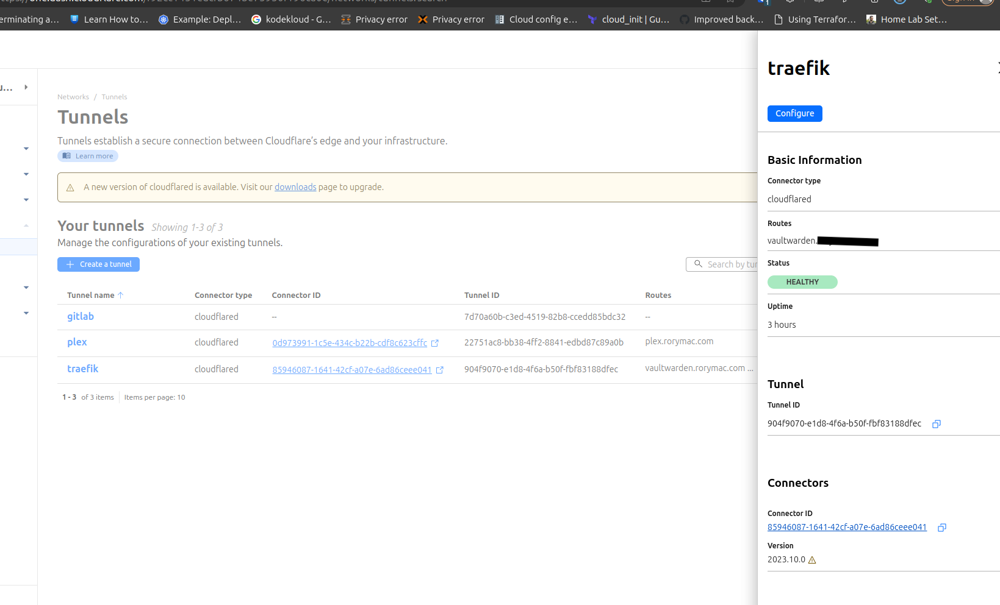
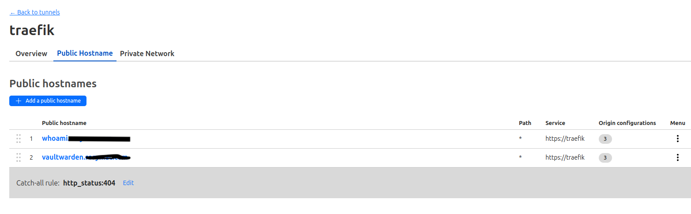
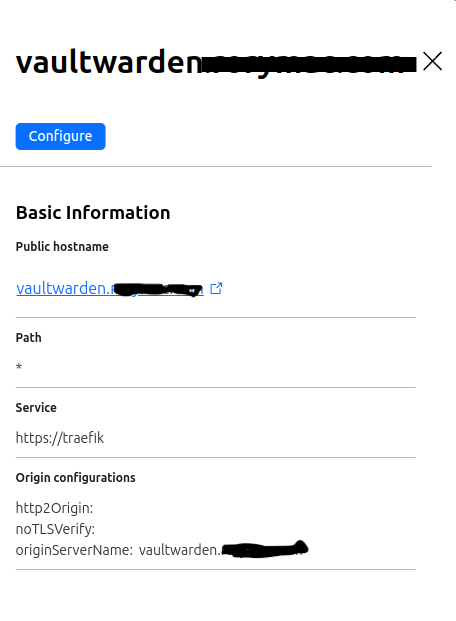

# cloudflared + traefik + docker for web-hosting without opened ports
# Introduction

This setup could potentially address scenarios such as serving web content from behind a carier grade NAT (CNAT) or in situations where a public IP isn't available. Surprisingly, the solution requires just one additional component: Cloudflare Tunnels. These tunnels establish a link between my server and Cloudflare without necessitating opened ports. In this blog post, I'll delve into my setup for achieving full encryption between the web service and my users, along with key considerations for similar implementations.

To read more about cloudflared tunnels view here: https://developers.cloudflare.com/cloudflare-one/connections/connect-networks/

# Configuration

## Traefik + cloudflared

Cloudflare Tunnels are operated via cloudflared, a software daemon provided by Cloudflare that initiates an outbound connection to the nearest Cloudflare points of presence to proxy internet traffic. As Cloudflare Tunnels offer limited routing functionality, specifically path-based routing, we combine them with the widely used reverse proxy Traefik, which integrates seamlessly with Docker. Cloudflare directs traffic to Traefik, which in turn routes it to individual Docker containers housing the web services we aim to expose.

Below is the docker-compose.yml configuration for Traefik and cloudflared.

```yaml
networks:
  cftunnel-transport:
    external: true
  cloudflaretunnel:
    external: true

services:
  tunnel:
    container_name: cloudflared-tunnel-traefik
    image: cloudflare/cloudflared:2023.10.0-amd64
    restart: unless-stopped
    command: tunnel run
    environment:
      - "TUNNEL_TOKEN="
    networks:
      - cftunnel-transport

  traefik:
    image: traefik:v2.10.7
    container_name: traefik_cloudflare_ingress
    restart: always
    networks:
      - cftunnel-transport
      - cloudflaretunnel
    volumes:
      - /var/run/docker.sock:/var/run/docker.sock:ro
      - ./traefik.yml:/traefik.yml:ro
      - ./certificates.yml:/certificates.yml:ro
      - ./origin-certificates/:/origin-certificates:ro
    labels:
      - "traefik.enable=true"
      - "traefik.http.routers.traefik-ui.rule=Host(`traefik-cf-docker01.internal`)"
      - "traefik.http.services.traefik-ui.loadbalancer.server.port=8085"
    logging:
      driver: fluentd
      options:
        fluentd-address: 127.0.0.1:24224
        fluentd-async: 'true'
        tag: docker.cloudflareTraefik
```
The Compose file defines a container for Traefik and a container for cloudflared. The Docker network cftunnel-transport is used for transport between Traefik and cloudflared. The Docker network cloudflaretunnel is used to expose Docker containers to Traefik.

To secure traffic between Traefik and cloudflared, a Cloudflare Origin Certificate is used. This can be generated in the Cloudflare dashboard and the files should be saved as mydomain.tld.pem and mydomain.tld.key into the origin-certificates folder. We will instruct Traefik to secure all TLS traffic with these certificates.
```yaml
tls:
  stores:
    default:
      defaultCertificate:
        certFile: /origin-certificates/rorymac.com.pem
        keyFile: /origin-certificates/rorymac.com.key

  certificates:
    - certFile: /origin-certificates/rorymac.com.pem
      keyFile: /origin-certificates/rorymac.com.key
```
traefik.yaml file:
```yaml
log:
  level: DEBUG

entryPoints:
  websecure:
    address: ":443"

providers:
  docker:
    endpoint: "unix:///var/run/docker.sock"
    exposedByDefault: false
  file:
    filename: certificates.yaml
```
### Cloudflare setup
Login to the cloudflare portal and head over to Zero Trust > Networks > Tunnels

Add a new tunnel and configure the following:

Add a public host name and configure the following:



To configure a service in the Cloudflare tunnel, add simply https://traefik as the destination. For Traefik to know which service to route the request to, we also have to specify the origin server name. Since Traefik can also speak HTTP/2, we can enable that as well. Also enable No TLS Verify

## Adding a service to the cloudflared / traefik tunnel
```yaml
services:

  vaultwarden:
    container_name: vaultwarden
    hostname: vaultwarden
    image: vaultwarden/server:1.30.1
    restart: unless-stopped
    networks:
       cloudflaretunnel:
    expose:
      - 80                 # Web UI
      - 443                # Web UI
    env_file:
      - container-vars.env
    volumes:
      - /etc/localtime:/etc/localtime:ro
      - ./data:/data
    labels:
      - traefik.enable=true
      - traefik.http.routers.vaultwarden.rule=Host(`vaultwarden.rorymac.com`)
      - traefik.http.routers.vaultwarden.entrypoints=websecure
      - traefik.http.routers.vaultwarden.tls=true
      - traefik.http.routers.vaultwarden.service=vaultwarden
      - traefik.http.services.vaultwarden.loadbalancer.server.port=80
networks:
  cloudflaretunnel:
    external: true
```