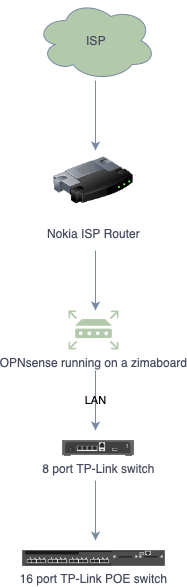
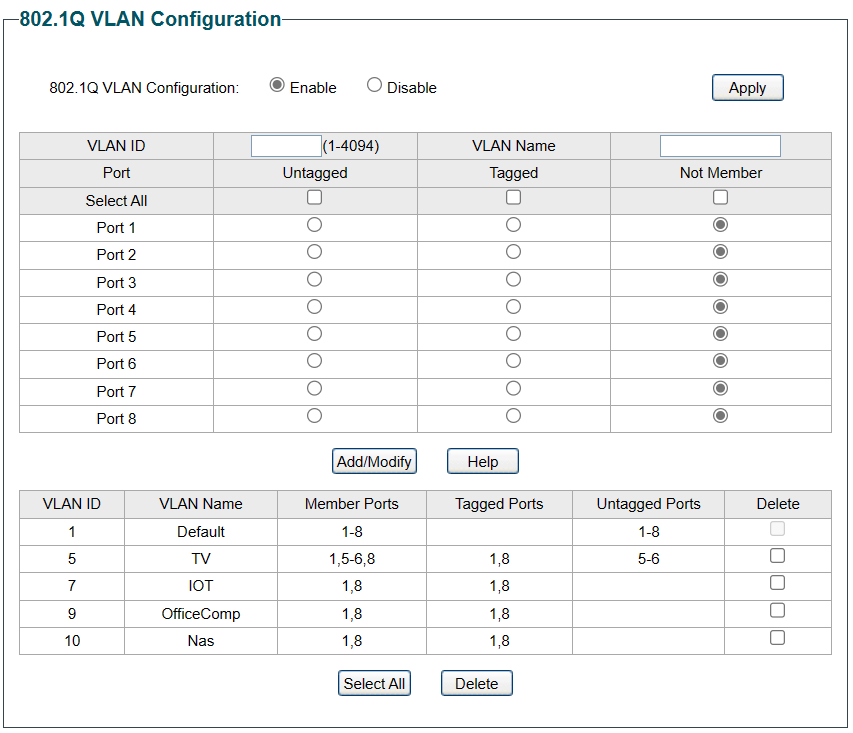
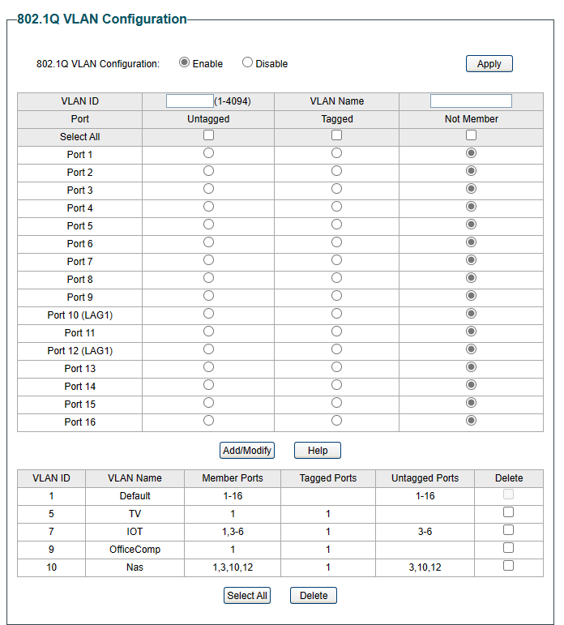

## Current Network setup
So my current setup is this. The internet comes in the my home using my local ISP ONT box which gives me full 1 Gb fiber, excellent! The nokia ISP router is put into bridged mode so that I can have the main opnsense router (in green) do all the routing for me. I have VLANS, DHCP and other services running on my opnsense which i would rather use than the bog standard Nokia router. I'll go through this setup later.

The opnsense router LAN port is connected to an 8 port TP-Link switch, which has VLANS configured on it and this switch is connected to an 16 port TP-Link poe switch up stair in my office. To pass the VLAN information the ports on both switch have to be tagged with all the VLANS so that traffic can be routed to the correct VLANS. 

### VLAN configuration (8 port switch)
TP-link TL-SG1016PE

### VLAN configuration (16 port switch)
TP-link TL-SG108E
